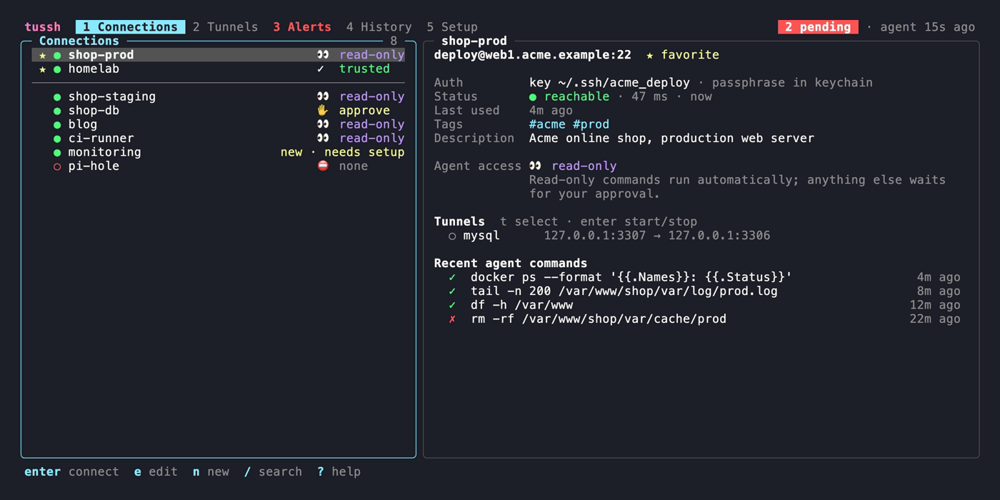
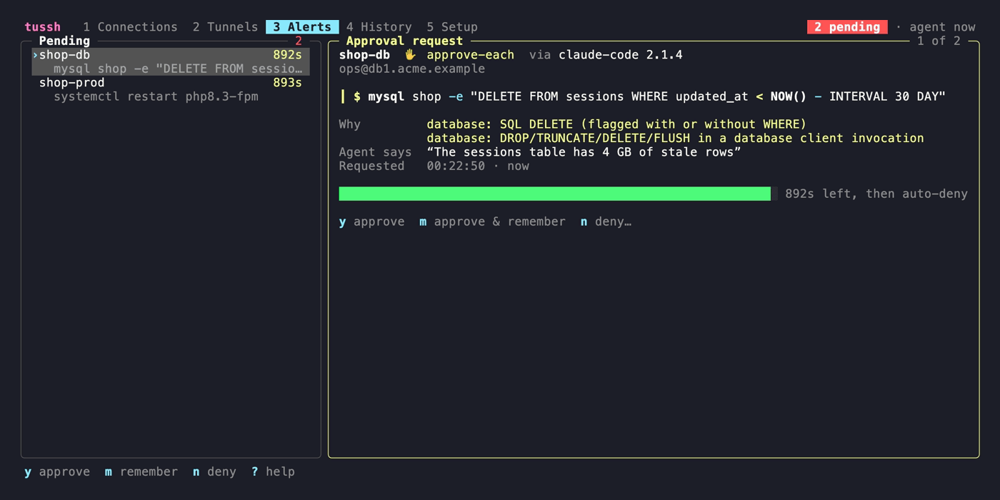
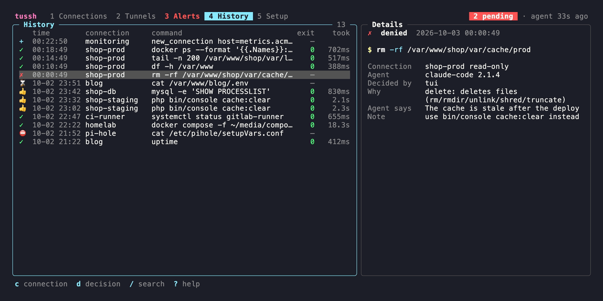
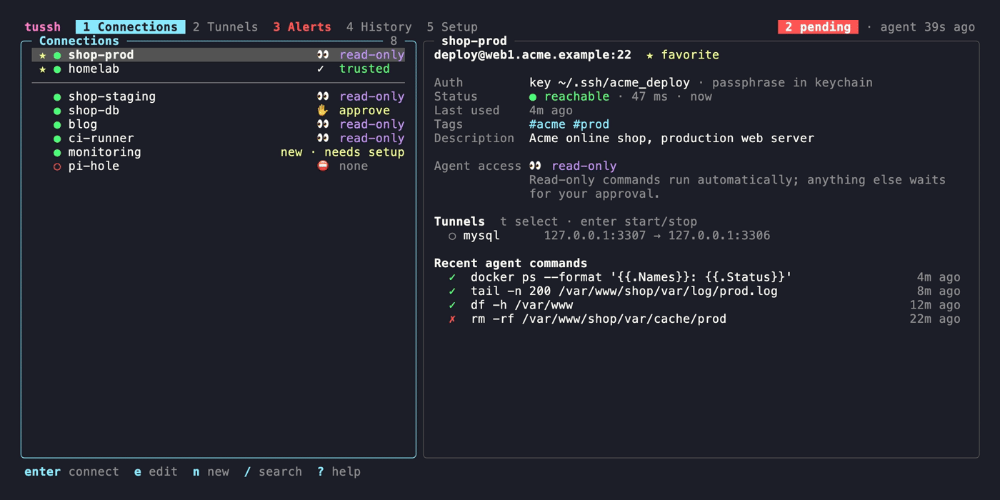
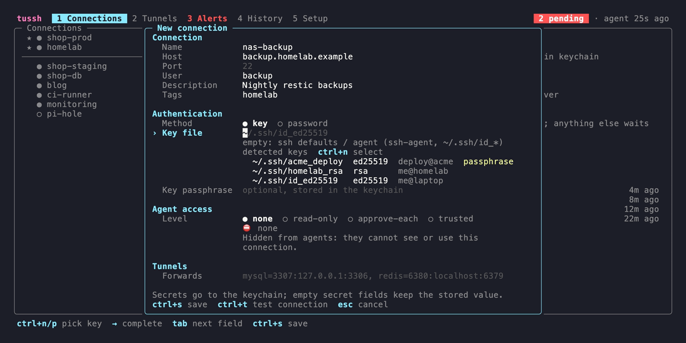

# tussh

A terminal SSH connection manager for **you** and an MCP server for your **AI agents**. Both work from one connection list, and each connection has its own access rules for agents.

- **You** run `tussh` in any terminal. You can add, edit and delete SSH connections (password or key), press **Enter** to open an interactive session, start and stop port forwards, approve or deny agent requests, and read the audit history.
- **Agents** connect through `tussh mcp` (stdio). They only see the connections you shared with them. Each command is run automatically, sent to you for approval, or refused, depending on the connection's **access level** and on the **sensitive command rules**.



*Connections: favorites on top, reachability, access levels, and the selected connection with its tunnels and recent agent commands.*

## Why

When an agent can `ssh` into your servers, it holds the same rights you do. tussh puts a policy layer in between: read-only commands can run automatically, risky ones need your approval, and connections you never shared stay invisible to agents. Every agent request is logged.

## Access levels

You set the level per connection (TUI: **l** cycles through the levels, or use the edit form). New connections start at `none`.

| Level | Read-only command | Any other command | Sensitive command |
|---|---|---|---|
| `none` | hidden: the agent cannot see or use the connection | hidden | hidden |
| `read-only` | runs automatically | needs approval | needs approval |
| `approve-each` | needs approval | needs approval | needs approval |
| `trusted` | runs automatically | runs automatically | needs approval |

**Read-only** uses the strict allowlist from herdr-ssh:

- The command must be a single command from the allowlist: `cat head tail wc grep egrep fgrep zcat ls stat file readlink realpath basename dirname md5sum sha1sum sha256sum cut echo pwd which df du free uptime uname whoami id groups w who last nproc lscpu lsblk vmstat ps pgrep lsof netstat ss tree sort find hostname date journalctl systemctl docker`.
- Some of these have argument restrictions: `find` without `-exec`/`-delete`/`-fprint*`, `systemctl` only for status-style subcommands, `docker` only for `ps`/`images`/`logs`/`inspect`/`version`/`info`/`stats --no-stream`, and so on.
- Any of `;` `&` `|` `<` `>` `` ` `` `$` `\`, a newline or a NUL byte anywhere in the command means it is **not read-only**. Such a command is not blocked. It goes to approval instead.
- When a read-only command runs automatically, it is re-quoted word by word. For example, `ls *.log` lists a file literally named `*.log` and does not expand a glob.

On `trusted` connections, and for every approved command, tussh sends exactly the command you saw to the remote shell.

## Sensitive commands

The sensitive command rules apply at **every** level. A command that matches always needs approval, even on `trusted`.

| Category | Examples |
|---|---|
| `secrets` | `.env*`, `*.pem`, `*.key`, `id_rsa`/`id_ed25519`, `/etc/shadow`, `credentials`, `.pgpass`, `.my.cnf`, `env.php`, `wp-config.php`, `env`/`printenv`, `ps e`, `/proc/*/environ`, `docker inspect`, `docker compose config`, `*_history` |
| `delete` | `rm`, `rmdir`, `unlink`, `shred`, `truncate`, `find -delete`, `find -exec rm`, `git clean`, `git reset --hard`, `git push --force`, `rsync --delete`, `dd of=`, `mkfs`, `fdisk` |
| `database` | `DROP …`, `TRUNCATE`, `DELETE FROM` (with or without `WHERE`), `UPDATE … SET` without `WHERE`, destructive statements in `mysql`/`psql`/`sqlite3`/`mongosh`/`redis-cli` invocations, `dropdb`, `artisan migrate:fresh`, `db:wipe`, `doctrine:schema:drop` |
| `docker` | `docker rm`/`rmi`, `… prune`, `volume rm`, `compose down` (with or without `-v`), `compose rm`, `kubectl delete/apply/…`, `helm uninstall/upgrade` |
| `system` | `systemctl stop/restart/disable/…`, `service X stop`, `reboot`, `shutdown`, `kill`/`pkill`/`killall`, `docker stop/kill/restart`, `crontab` (except `-l`), firewall changes, user and password changes |
| `permissions` | `chmod -R`/`chown -R`, world-writable modes (`777`, `o+w`, …), any permission change on a system path |
| `packages` | `apt remove/purge/autoremove`, `yum/dnf remove`, `apk del`, `pacman -R`, `pip uninstall`, `npm uninstall -g`, `brew uninstall`, `dpkg -r`, `rpm -e` |
| `system-write` | redirects (`>`, `>>`, `&>`) into `/etc`, `/usr`, `/var/lib`, `/var/log`, `/dev/sd*`, … or `authorized_keys`, `tee` and `sed -i` on such paths, and `cp`/`mv`/`ln` into such paths |
| `remote-code` | `curl … \| sh`, `wget … \| bash`, `bash <(curl …)`, `sh -c "$(curl …)"` |
| `unsure` | `sh -c`, `eval`, `python -c`, `perl -e`, `base64 -d`, pipes into a shell, `$(…)`, backticks, `<(…)`, `$'…'`, here-docs into a shell, `su`, `sudo -i`, a variable used as the command, unparseable quoting, and an invalid rules file |

Rules are checked against every simple command in the line, so `ls && rm x` is caught. Wrappers such as `sudo`, `env`, `nohup`, `timeout`, `xargs`, `nice`, `command` and `VAR=x` prefixes are unwrapped first. Commands run inside `docker exec`, `docker compose exec`, `kubectl exec` or `ssh` are checked as well. Paths are resolved to the base command name (`/bin/rm` counts as `rm`), and quotes and backslashes are removed before matching (`"r"m` and `r\m` count as `rm`).

**When in doubt, tussh asks.** If the classifier cannot see what a command really does, it reports an `unsure` finding, and the command needs approval.

### Your own rules: `~/.config/tussh/rules.json`

```json
{
  "rules": [
    { "id": "terraform-destroy", "description": "terraform destroy", "category": "infra",
      "command": "terraform", "args_pattern": "\\bdestroy\\b" },
    { "id": "prod-deploy", "description": "production deploy script", "pattern": "deploy\\.sh\\s+prod" },
    { "id": "maintenance", "command": ["artisan", "console"], "args_pattern": "^down$" }
  ]
}
```

| Field | Meaning |
|---|---|
| `id` | Shown in approvals and the audit log. Defaults to `user-N`. |
| `description`, `category` | Shown in the approval request. The category defaults to `user`. |
| `pattern` | An [RE2](https://github.com/google/re2/wiki/Syntax) regex matched against the whole command line |
| `command` | A command name or a list of names, matched against each simple command (after unwrapping, by base name) |
| `args_pattern` | Optional, needs `command`. A regex matched against that command's arguments, joined by spaces. |
| `case_sensitive` | Defaults to `false`, so patterns ignore case. |

Each rule needs `pattern`, `command`, or both. User rules only add approvals. They cannot switch off a built-in rule.

If the file is invalid (broken JSON, an unknown field or a bad regex), **every** agent command needs approval until you fix it, and the TUI shows a warning.

## Approval flow

1. An agent calls `run_command`. tussh classifies the command and applies the access level.
2. If the command needs approval, tussh writes a request to `~/.local/state/tussh/approvals/` (files with mode 0600 and atomic writes), and the MCP call **blocks**.
3. The TUI's **Alerts** tab shows each pending request as a card: the connection and its access level, the requesting agent (MCP `clientInfo`), the command, why it needs approval, the agent's optional justification, and a countdown bar until it is denied automatically. When a new request arrives while the TUI is open, the same card pops up over the current view. Keys: **y** approve, **m** approve & remember (see below), **n** deny (you can type a note for the agent, **Enter** sends it, **Esc** cancels), **Esc** later.

   

   *Alerts: pending agent requests with the reasons, the agent's justification and the auto-deny countdown.*
4. If no TUI is open, tussh sends a macOS notification (`osascript`). It fails silently.
5. Without a decision within **120 s**, the request is denied automatically, and the agent gets a clear message. You can change the timeout with `approval_timeout_seconds` in `~/.config/tussh/settings.json` or the `TUSSH_APPROVAL_TIMEOUT` environment variable.

A deny note is passed to the agent with the denial (`denied by the user: <note>`) and stored in the audit log.

Exactly one decision wins. Decisions are created exclusively with `link(2)`, so a late approval cannot race with the timeout. You can also approve requests from a shell: `tussh pending`, `tussh approve ID`, `tussh deny ID`. `tussh alerts` opens the TUI directly on the Alerts tab. `tussh alerts --popup` also quits once every request it showed is decided (handy for a popup window in a terminal multiplexer).

`~/.config/tussh/settings.json` (optional):

```json
{ "approval_timeout_seconds": 120, "disable_notifications": false,
  "remember_ttl_hours": 8, "disable_audit_output": false }
```

### Approve & remember

**m** on a request approves it and also allows **exactly this command** (byte for byte) on **this connection** for a while (`remember_ttl_hours`, default 8 h, max one week). Until then, an agent that sends the identical command on that connection runs it without asking again. Anything else, even the same command with an extra space or a `; …` appended, asks as usual, and other connections are not affected. Sensitive commands can be remembered too, but only as an exact match.

Remembered commands are files in `~/.local/state/tussh/allow/` (one per entry, mode 0600), so every MCP process sees them, also when no TUI is running. They show up in the connection's detail pane with their expiry; **R** selects them and **Enter** revokes one. Deleting the connection revokes its entries. The audit log records such runs as `approved` by `remembered`.

## Audit log

tussh appends every agent request to `~/.local/state/tussh/audit.jsonl` (mode 0600). Each entry records the time, connection, access level, command, decision (`auto`, `approved`, `denied`, `timeout` or `blocked`), who decided, the reasons, the agent, the justification, your deny note, the exit code, whether the command timed out, and its duration.

It also keeps the **command output, bounded**: at most 4 kB of stdout and 4 kB of stderr per entry (the beginning and the end). The connection's own stored password or passphrase is replaced with `[redacted]` if it shows up in the output, but anything else a command prints (for example an approved `cat .env`) lands in the log. Set `"disable_audit_output": true` in `settings.json` to keep no output at all. Browse the log in the **History** tab.



*History: the audit log; the selected request was denied with a note for the agent.*

## Connections and secrets

- Connections are stored in `~/.config/tussh/connections.json` (mode 0600). Each one has a name, host, port, user, auth (`key` or `password`), a key path, an optional description and **tags**, a **favorite** flag, the access level and tunnels. **The file contains no secrets.** There are no groups: put things like prod/staging in the name or in a tag. Files from older versions with a `group` field still load; the group becomes a tag and the field is dropped the next time tussh saves the file.
- The **last use** of a connection (your interactive session or an agent command that ran) is kept in `~/.local/state/tussh/used/`, one empty file per connection whose modification time is the time of use.
- `connections.json` is written by the TUI and by the MCP tool `new_connection`. Every write is a read-modify-write under an exclusive lock (`connections.json.lock`, `flock`) followed by an atomic rename, so neither side loses the other's changes. The TUI reloads the file when it changes; an open form keeps your unsaved edits.
- **Passwords and key passphrases** are stored in the macOS Keychain under the service `tussh` (via [go-keyring](https://github.com/zalando/go-keyring); on Linux, the Secret Service).
- **Password auth works without prompts.** tussh starts `ssh` with `SSH_ASKPASS=<tussh binary>` and `SSH_ASKPASS_REQUIRE=force`, which requires OpenSSH 8.4 or later. ssh then calls tussh back, and tussh reads the secret from the keychain. Each ssh process gets a one-time token file in the state dir, and the askpass mode only answers for a live token. Secrets never appear in arguments, logs or the UI.
- Key connections without a passphrase use `BatchMode=yes`. An empty key path means ssh's own defaults (ssh-agent, `~/.ssh/id_*`).
- Host keys must already be known. Agent runs never accept a new host key, so connect once yourself from the TUI first. In interactive sessions, ssh asks you as usual.
- **Import:** press **i** on the Connections tab to pick hosts from `~/.ssh/config`. tussh only reads that file. It resolves each host with `ssh -G` and imports it with access level `none` and the tag `ssh-config`.

Paths can be overridden with `TUSSH_CONFIG_DIR` and `TUSSH_STATE_DIR` (or `XDG_CONFIG_HOME`/`XDG_STATE_HOME`). The tests use `TUSSH_KEYRING=file:<path>`, a plaintext file backend. **Use it for testing only.**

## TUI

Every view has the same frame: the app name, the tabs (**1**–**5**) and status chips at the top (pending requests as a red badge, running tunnels, the last agent activity), and the 3–4 most relevant keys at the bottom. **?** opens an overlay with all keys. Colors come from your terminal's ANSI palette, so tussh follows your terminal theme. On terminals narrower than 90 columns, side-by-side panes are stacked.



*Connections, search, an approval request and the history.*

| View | What you see | Keys |
|---|---|---|
| Connections | Left: the list. Favorites (★) on top, separated by a thin line, then the most recently used, then by name. Each row has a reachability dot (● reachable, ○ unreachable, ◌ checking; a plain TCP connect to host:port every 45 s, no login) and the access level (⛔ none, 👀 read-only, ✋ approve-each, ✓ trusted). Right: user@host:port, auth, reachability, last use, tags, description, the access level with a one-line explanation, the connection's tunnels with live status, remembered commands and the last agent commands. | **Enter** connect (interactive `ssh` in this terminal; you return to the TUI afterwards) · **e** edit · **n** new · **x** delete (with confirmation; also removes the stored secrets and remembered commands) · **f** favorite · **l** cycle the access level · **/** search (fuzzy on the name, substring on host, user, description and tags; **Esc** clears) · **r** check reachability now · **t** select a tunnel, **Enter** start/stop · **R** select a remembered command, **Enter** revoke · **i** import from `~/.ssh/config` |
| Tunnels | All tunnels with status. They run as background `ssh -N -L` processes, tracked by pid files in the state dir, so they keep running after the TUI exits. Define them in the connection form as `name=local:host:port, …`. Agents cannot start tunnels. | **Enter** start or stop |
| Alerts | The pending requests (list on the left when there are several) and the selected one as a card. | **y** approve · **m** approve & remember · **n** deny with an optional note · **↑↓** next request |
| History | A table of agent requests: decision (✓ auto, 👍 approved, ✗ denied, ⌛ timeout, ⛔ blocked, + created by `new_connection`), time, connection, command, exit code and duration. The detail pane shows the full command, reasons, justification, deny note and the recorded output. | **c** cycle the connection filter · **d** cycle the decision filter · **/** search · **Esc** clear filters · **Enter** details (narrow terminals) |
| Setup | Paths (binary, config, state, secrets) and the registration snippet per harness, with ✓ where tussh finds a `tussh` entry in the harness's user config (`~/.claude.json`, `~/.codex/config.toml`, `~/.gemini/settings.json`, `~/.config/opencode/opencode.json`, `~/.cursor/mcp.json`; files are only read, project-level registrations are not detected). | **Enter** copies the snippet |
| all | | **Tab**/**Shift+Tab** or **1-5** switch views · **?** help · **q** quit |

The connection form opens as a dialog with four sections: *Connection* (name, host, port, user, description, comma-separated tags), *Authentication* (key or password, key file, passphrase or password), *Agent access* (level with an explanation) and *Tunnels*. **Tab**/**↑↓** move between fields (Tab never switches views while a form, the search or a deny note is open), **←→** change a choice, **Ctrl+T** tests the connection, **Ctrl+S** saves, **Esc** cancels. Leave the password or passphrase field empty to keep the stored value.

**Key file field.** While it has focus, a list below it shows the private keys tussh finds in `~/.ssh` (`$TUSSH_SSH_DIR` overrides the directory): the path, the key type and comment from the matching `.pub`, and *passphrase* for encrypted keys. A file counts as a private key when it starts with an OpenSSH or PEM `PRIVATE KEY` header; tussh only reads the first bytes (the header and, for OpenSSH keys, the public part) and never shows key material. `.pub` files, `known_hosts*`, `config`, `authorized_keys*`, sockets and directories are skipped. What you type filters the list (substring or fuzzy on the path and comment). **Ctrl+N**/**Ctrl+P** highlight a key and **Enter** puts it into the field (Enter does not save while a key is highlighted, **Ctrl+S** still does; **Esc** removes the highlight). While you type a path, the rest of the best match appears as faint text (private keys first, then directories; `~` is expanded, directories end in `/`); **→** at the end of the input or **Ctrl+F** accepts it. Tab still moves to the next field. Below the field a hint checks the file: ✓ a valid private key (type · comment), ✗ file not found, ✗ a public key (`.pub`), ⚠ permissions too open (`chmod 600`), ⚠ encrypted without a passphrase. An empty field means ssh's defaults (ssh-agent, `~/.ssh/id_*`).



*The connection form suggests the private keys it finds in `~/.ssh`.*

**Test connection** (Ctrl+T) runs `ssh … true` with the form's values, non-interactively (`BatchMode`, askpass for a password or passphrase, 5 s connect timeout, no new host keys), and shows the result in the form. It only runs when you press the key. A password you typed but did not save yet is put into the keychain under a temporary entry for the duration of the test and removed afterwards.

## MCP setup

Register once per harness. The **Setup** tab shows the same snippets with your real binary path and copies them to the clipboard.

| Harness | Command / config |
|---|---|
| Claude Code | `claude mcp add --scope user tussh -- ~/.local/bin/tussh mcp` |
| Codex CLI | `codex mcp add tussh -- ~/.local/bin/tussh mcp`, or in `~/.codex/config.toml`: `[mcp_servers.tussh]` with `command = "…/tussh"` and `args = ["mcp"]` |
| Gemini CLI | `gemini mcp add -s user tussh ~/.local/bin/tussh mcp`, or `{"mcpServers": {"tussh": {"command": "…/tussh", "args": ["mcp"]}}}` in `~/.gemini/settings.json` |
| opencode | `{"mcp": {"tussh": {"type": "local", "command": ["…/tussh", "mcp"], "enabled": true}}}` in `~/.config/opencode/opencode.json` |
| Cursor | `{"mcpServers": {"tussh": {"type": "stdio", "command": "…/tussh", "args": ["mcp"]}}}` in `~/.cursor/mcp.json` |

Use the absolute path (shown in the Setup tab). These formats were checked against each harness's docs in October 2026. Two details are unverified: whether Gemini's `mcp add` defaults to stdio for a path, and whether Cursor still accepts entries without `"type"`.

MCP tools:

| Tool | Does |
|---|---|
| `list_connections` | Returns the name, description, tags and access level of every connection that is not `none`. It returns no hosts, users or secrets. |
| `run_command(connection, command, justification?, timeout?)` | Classifies the command, then runs it, waits for approval, or refuses it. It runs `ssh -T` with `ConnectTimeout=10`, `ClearAllForwardings=yes`, `ControlPath=none` and `ForwardAgent=no`, and with stdin closed. The remote timeout defaults to 30 s (max 600 s), and on timeout the whole process group is killed. stdout and stderr are capped at 20 kB each (head and tail are kept). Returns `exit_code`, `stdout`, `stderr`, `timed_out`, `truncated` and `decision`. A command you remembered with **m** on this connection runs without asking again until the entry expires. |

| `new_connection(name, host, port?, user?, description?, tags?, tunnels?)` | Adds a connection to your list. Agents can set **only** these fields; `tunnels` is a list of `name=[bind:]local:host:port`, validated like the form. The schema has no access level, auth method, key file, password or passphrase, and any other field is rejected (`additionalProperties: false`; tussh also rejects such fields itself and never logs their values). The connection is created with access level `none`, no credentials, `created_by: "agent"` (plus the harness name and version from `clientInfo` and the time) and `needs_setup: true`, so it does not show up in `list_connections` and `run_command` cannot use it. The result tells the agent that it is not usable until you set the authentication and an access level. Names must be unique (case-insensitive); the error for a duplicate also reveals that a hidden connection with that name exists. At most 20 agent-created connections can wait for setup at once. |

You are notified like for approvals: a macOS notification when no TUI is open, a message in the footer when one is. The list shows such connections with a **new · needs setup** badge, the detail pane shows who created them and when, and the Alerts tab lists them (**e** opens the form for the first one). Saving the connection in the form clears `needs_setup`; **x** deletes it as usual. Every `new_connection` call is in the audit log (`created`, or `blocked` with the reason).

There is deliberately no tool for interactive sessions or tunnels. A broken `connections.json` exposes nothing (fail closed).

## Security notes

- **The only hard boundary is on the server.** tussh limits what *this MCP server* does. It is not a sandbox. An agent with a local shell can run `ssh` itself. It can also read what the user account can read, and that includes the Keychain items tussh created (for example with `security find-generic-password`). For real limits, give agents a dedicated remote user with minimal rights, `sudo` restrictions, forced commands or `restrict` in `authorized_keys`, and read-only database users.
- **The classifier is best-effort.** It only sees the command line, not the contents of scripts (`./deploy.sh`) or what a program does at runtime. It is conservative: when it is unsure, it asks. Treat `trusted` as "mostly delegated".
- **Permission-skipping flags.** Harnesses started with `--dangerously-skip-permissions`, `--yolo` or similar approve every MCP call on their side. tussh's own approvals still apply, but such agents also have a local shell (see the first point).
- **Use separate keys per area.** Use different keys for company, client and private servers, so revoking one area does not affect the others.
- The askpass token, the approval files, the remembered commands and the audit log all live in the state dir with mode 0600. The audit log contains bounded command output unless you switch that off (see [Audit log](#audit-log)).

## Install

Requires Go 1.26+ and OpenSSH 8.4+.

```sh
make install          # builds to ~/.local/bin/tussh
# or: go build -o ~/.local/bin/tussh .
```

`make build` builds `bin/tussh`, and `make test` runs all tests.

## Tests

```sh
make test             # gofmt + go vet + go test -race ./... (incl. the docker integration test)
make test-unit        # same without the integration test (TUSSH_INTEGRATION=0)
```

| Where | Covers |
|---|---|
| `internal/classify` | The read-only allow/deny/bypass cases ported from herdr-ssh, re-quoting, about 150 sensitive and not-sensitive cases, user rules, fail-closed invalid rules |
| `internal/policy` | The access-level decision matrix and which command is sent |
| `internal/allow` | Remembered commands: exact match per connection, expiry, revoke, 0600 files |
| `internal/agent` | A remembered command runs without a request, an expired or foreign one asks again, deny notes reach the agent and the log, output capture can be switched off |
| `internal/approval` | Submit/resolve, 30 concurrent resolvers with exactly one winner, wait/timeout/cancel, no partial reads during atomic writes, stale cleanup, TUI presence |
| `internal/config`, `internal/secrets` | Validation (no argv injection), 0600 store without secrets, legacy `group` → tag migration, tags, last use, the in-memory and file keyrings |
| `internal/harness` | Snippets, read-only detection of registrations (also invalid and JSONC files) |
| `internal/sshrun` | ssh argv per auth/mode, exit codes, truncation, timeout kills the process group, askpass tokens, the connection test with a temporary secret |
| `internal/tui` | Model-level tests: forms (secrets go to the keyring, tags, test connection, Tab stays in the form, port placeholder, the key file field: key detection with keys generated by `ssh-keygen` in a temp dir, `.pub` pairing, encrypted keys, permission warnings, path completion, the key list keys), sorting and favorites, search, reachability, level cycling, delete, the approval popup, deny notes, approve & remember and revoking, agent-created connections (live reload without touching an open form, the needs-setup badge, setup from Alerts, no lost writes), history filters, Setup registration, ssh config import, and a layout test that renders every view at 140×40, 110×32 and 80×24 with colors on and checks screen size and column alignment |
| `e2e_test.go` | The real binary as a stdio MCP subprocess: handshake, list, auto/approve/deny/timeout/cancel, remembered commands and expiry, deny notes, askpass through the binary (the secret never reaches the config or the audit log), fail-closed config, audit log, `new_connection` (schema, rejected access level/credential/unknown fields, duplicates, tunnel validation, level none + needs_setup, invisible to agents, concurrent writes with the TUI) |
| `integration_test.go` | A throwaway `alpine` sshd container with a **password user and a key user**: password auth via askpass, key auth, read-only auto, approve and deny with real effects, sensitive commands on trusted, remote timeout, approval timeout, a tunnel, and the form's connection test with an unsaved password. Skipped without docker or with `TUSSH_INTEGRATION=0`. The container, the key and the temp dirs are removed afterwards. |

No test touches `~/.ssh`, the real Keychain or a running herdr. CI (`.github/workflows/tests.yml`, job `tests`) runs everything on ubuntu, including the integration test.

## Screenshots

The images in `docs/screenshots/` are rendered from the [VHS](https://github.com/charmbracelet/vhs) tapes in `docs/tapes/` with demo data only:

```sh
brew install vhs pngquant oxipng   # vhs pulls ttyd and ffmpeg
make screenshots                   # or: bash docs/screenshots.sh alerts
```

`docs/screenshots.sh` builds tussh into a throwaway sandbox (its own `HOME`, config and state dirs, a file keyring, demo keys made by `ssh-keygen`), seeds it with `docs/demo/seed.go` (connections on `*.example` hosts, last use, a remembered command, an audit log), and starts a real `tussh mcp` that adds an agent-created connection and leaves two approval requests pending. The tapes run `docs/demo/tui.go`, the normal TUI with a simulated reachability check because the demo hosts do not exist. The sandbox is removed afterwards. Re-render the screenshots in the same PR when the UI changes visibly.

## License

MIT, see [LICENSE](LICENSE).
